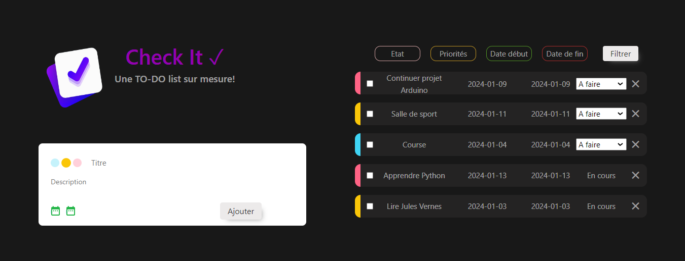

# Check It - Projet Todo App

Pour lancer l'application, il faut d'abord se placer dans le dossier racine du projet et lancer les commandes suivantes :

```
npm i
```
Cette commande va installer tous les packages nécessaires afin de faire fonctionner l'application.

```
npm run dev
```
Cette commande va lancer l'application en local sur le port 5173 (http://localhost:5173/).

Vous n'avez plus qu'à vous rendre sur cette adresse sur n'importe quel navigateur pour utiliser l'application.

#### Page principale


## Fonctionnalités

### Ajouter une tâche
Une fois sur l'adresse indiquée ci-dessus, vous trouverez à droit une carte qui va vous permettre d'ajouter une nouvelle tâche à la liste.
Vous devez rentrer le titre de la tâche, ainsi que sélectionner les dates de début et de fin de cette dernière.
Lorsque la sélection de vos dates sera bonne, l'indicateur en forme de calendrier deviendra vert.

Vous pouvez également renseigner une description plus détaillée de la tâche, ainsi que de modifier la priorité de cette dernière (faible, moyenne, haute),
en cliquant sur les boutons (bleu, jaune, rouge) à côté du titre de la tâche.

Une fois toutes vos informations remplies, vous pouvez ajouter la tâche à la liste en cliquant sur le bouton "Ajouter".

Si une erreur survient, un message d'erreur apparaîtra en haut de la page.

### Visualisation des tâches
Sur la droite de l'application sur ordinateur, ou en bas sur mobile, vous trouverez la liste des tâches que vous avez ajouté.
Vous pouvez voir le titre de la tâche, sa priorité (en fonction de la couleur du bandeau à gauche, bleu = priorité basse, jaune = priorité moyenne et rouge = priorité haute), ainsi que sa date de début et de fin.

Si vous cliquez sur une tâche, vous pourrez voir sa description.
Attention, si vous cliquez sur la croix à droite de la tâche, vous supprimerez cette dernière.

Vous pouvez également modifier le statut d'une tâche en cliquant sur ce dernier.
A gauche d'une tâche, vous trouverez une checkbox permettant de terminer une tâche.
Lorsqu'une tâche est définie comme terminée, vous ne pouvez plus modifier son statut à moins de décocher la checkbox.

### Filtre la liste des tâches
Au dessus de la liste des tâches, vous trouverez plusieurs boutons permettant de filtrer la liste des tâches.
Vous pouvez filtrer les tâches par priorité, par statut, ou par date de début et de fin.

L'ordre dans lequel vous cliquerez sur ces boutons influencera la méthode de filtrage (le premier filtre sur lequel vous cliquerez sera celui qui sera appliqué en premier, etc..).
Une fois que vous avez défini quels filtres appliquer et dans quel ordre, vous pouvez cliquer sur le bouton "Filtrer" pour appliquer les filtres.

La liste de tâches se retrouvera donc filtrée selon les filtres que vous avez appliqué.


Dans toute l'application, vous trouverez les informations concernant le type de données que vous regarder en positionnant votre souris sur les différents éléments.